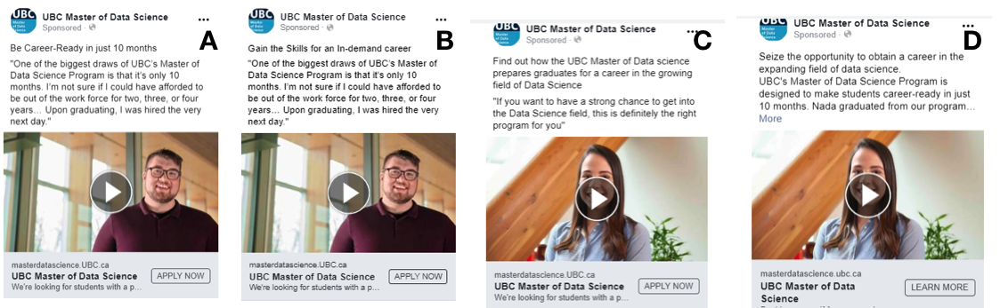

```{r setup, include=FALSE}
knitr::opts_chunk$set(echo = TRUE)
```

\newpage

# Lab Overview

This lab focuses on conceptual terminology in the design of experiments along with types of statistical questions. Moreover, it explores how we can communicate our A/B testing findings. Finally, we will work with a three-way ANOVA with blocking along with multiple comparisons.

# Lab Mechanics

rubric={mechanics:5}

- Paste the URL to your GitHub repo here: **INSERT YOUR GITHUB REPO URL HERE**
- Once you finish the assignment, you must **knit** this `R` markdown to create a `.pdf` file and push everything to your GitHub repo using `git push`. You are responsible for ensuring all the figures, texts, and equations in the `.pdf` file are appropriately rendered.
- **You must submit the rendered `.pdf` file to Gradescope.**

> **Heads-up:** You need to have a minimum of 3 commits.

# Code Quality

rubric={quality:3}

The code that you write for this assignment will be given one overall grade for code quality. Check our [**code quality rubric**](https://github.com/UBC-MDS/public/blob/master/rubric/rubric_quality.md) as a guide to what we are looking for. Also, for this course (and other MDS courses that use `R`), we are trying to follow the `tidyverse` code style. There is a guide you can refer too: <http://style.tidyverse.org/>

Each code question will also be assessed for code accuracy (i.e., does it do what it is supposed to do?).

# Writing

rubric={writing:3}

To get the marks for this writing component, you should:

- Use proper English, spelling, and grammar throughout your submission (the non-coding parts).
- Be succinct. **This means being specific about what you want to communicate, without being superfluous.**

Check our [**writing rubric**](https://github.com/UBC-MDS/public/blob/master/rubric/rubric_writing.md) as a guide to what we are looking for.

# A Note on Challenging Questions

Each lab will have a few challenging questions. These are usually low-risk questions and will contribute to maximum 5% of the lab grade. The main purpose here is to challenge yourself or dig deeper in a particular area. When you start working on labs, attempt all other questions before moving to these questions. If you are running out of time, please skip these questions.

We will be more strict with the marking of these questions. If you want to get full points in these questions, your answers need to

- be thorough, thoughtful, and well-written,
- provide convincing justification and appropriate evidence for the claims you make, and
- impress the reader of your lab with your understanding of the material, your analytical and critical reasoning skills, and your ability to think on your own.

# Setup

If you fail to load any packages, you can install them and try loading the library again.

```{r load libraries, message=FALSE, warning=FALSE}
library(kableExtra)
library(tidyverse)
library(binom)
library(broom)
library(DescTools)
```

\newpage

# Exercise 1: Name that Statistical Question!

rubric={reasoning:10}

In [**DSCI 552**](https://pages.github.ubc.ca/MDS-2023-24/DSCI_552_stat-inf-1_students/lecture-notes/01_lecture-sampling-through-simulation.html#landscape-of-statistical-questions), you were introduced to different types of statistical questions. Let us refresh our knowledge of these here and play "*name that statistical question*". For each question below, assign the answer to one of the following types of statistical question being asked:

- **Descriptive.**
- **Exploratory.**
- **Inferential.**
- **Predictive.**
- **Causal.**
- **Mechanistic.**

**Question 1.1:** Is wearing sunscreen associated with a decreased probability of developing skin cancer in Canada?

**ANSWER:**

_Type your answer here, replacing this text._

**Question 1.2:** Is there a relationship between alcohol consumption and socioeconomic status in a given non-representative 2018 City of Vancouver dataset?

**ANSWER:**

_Type your answer here, replacing this text._

**Question 1.3:** Does a more concise Google ad lead to an increased number of visits to the advertised company's website?

**ANSWER:**

_Type your answer here, replacing this text._

**Question 1.4:** How do societal changes in general in human behaviour lead to a reduction in the number of COVID-19 confirmed cases?

**ANSWER:**

_Type your answer here, replacing this text._

**Question 1.5:** Does reduced caloric intake cause weight-loss?

**ANSWER:**

_Type your answer here, replacing this text._

**Question 1.6:** Do tweets with GIFs get more impressions than tweets that do not?

**ANSWER:**

_Type your answer here, replacing this text._

**Question 1.7:** Does including a GIF in tweets lead to more profile visits than tweets that do not include a GIF?

**ANSWER:**

_Type your answer here, replacing this text._

**Question 1.8:** How many mentions will my next tweet get?

**ANSWER:**

_Type your answer here, replacing this text._

**Question 1.9:** How many accounts are there on Twitter today?

**ANSWER:**

_Type your answer here, replacing this text._

**Question 1.10:** Does increasing the contrast in images lead to better visual discrimination of visually impaired image content?

**ANSWER:**

_Type your answer here, replacing this text._

\newpage

# Exercise 2: How Would We Analyze that Data?

## Q2.1. Key Terminology

rubric={reasoning:12}

It is crucial for us to have language/terminology that we can use to discuss concepts related to experimentation and causal inference. It takes time and practice for us to commit these terms and corresponding definitions to our memory to use them fluidly in practice. Let us get some more practice by matching language/terminology with their definitions.

**Read the table below** and assign the correct term: 

- **Confounder**.
- **Randomization**.
- **Observational study**.
- **Stratification**.
- **A/B testing**.
- **Blocking**.
- **Treatment**.
- **Factor**.
- **Experimental unit**.
- **Replicate**.
- **Balanced design**. 
- **Factorial design**.

```{r echo=FALSE}
tableQ2_1 <- data.frame(
  Terms = c(
    "Your answer goes here", "Your answer goes here", "Your answer goes here",
    "Your answer goes here", "Your answer goes here", "Your answer goes here",
    "Your answer goes here", "Your answer goes here", "Your answer goes here",
    "Your answer goes here", "Your answer goes here", "Your answer goes here"
  ),
  Definitions = c(
    "Process of splitting the population into homogenous subgroups and sampling observational units from the population independently in each subgroup.",
    "Technique to investigate effects of several variables in one study; experimental units are assigned to all possible combinations of factors.",
    "A variable that is associated with both the explanatory and response variable, which can result in either the false demonstration of an association, or the masking of an actual association between the explanatory and response variable.",
    "Grouping experimental units (i.e., in a sample) together based on similarity.",
    "Explanatory variable manipulated by the experimenter.",
    "The entity/object in the sample that is assigned to a treatment and for which information is collected.",
    "Repetition of an experimental treatment.",
    "Equal number of experimental units for each treatment group.",
    "Process of randomly assigning explanatory variable(s) of interest to experimental units (e.g., patients, mice, etc.).",
    "A combination of factor levels.",
    "Statistically comparing a key performance indicator (conversion rate, dwell time, etc.) between two (or more) versions of a webpage/app/add to assess which one performs better.",
    "A study where the researcher does not randomize the primary explanatory variables of interest."
  )
)

# YOUR CODE HERE

kbl(tableQ2_1) %>%
  kable_paper(full_width = F) %>%
  column_spec(1, bold = T, border_right = T) %>%
  column_spec(2, width = "30em") %>%
  kable_styling(latex_options = "HOLD_position")
```

## Q2.2. An Experimental Case

rubric={reasoning:10}

As part of a more extensive study to understand how aging affects learning and memory, [Timbers et al. (2013)](https://gw2jh3xr2c.search.serialssolutions.com/log?L=GW2JH3XR2C&D=Z5R&J=NEUROFAGI&P=Link&PT=EZProxy&A=Intensity+discrimination+deficits+cause+habituation+changes+in+middle-aged+Caenorhabditis+elegans&H=e9ec704d75&U=https%3A%2F%2Fezproxy.library.ubc.ca%2Flogin%3Furl%3Dhttps%3A%2F%2Fwww.clinicalkey.com%2Fcontent%2FplayBy%2Fdoi%3Fv%3D10.1016%2Fj.neurobiolaging.2012.03.016) performed an experiment by using a model organism, the nematode *Caenorhabditis elegans*, to answer the following:

**Question:** 

*Does aging lead to changes in reflexive responses to mechanical stimuli?*

**Methods:**

*C. elegans* were randomly assigned to be tested for their response to mechanical stimuli at either the young adult (72 hours) or old adult (120 hours) age. Response to mechanical stimuli was quantified by the distance (in millimetres) *C. elegans* crawled backwards after application of the stimulus; this is called the reversal distance.

In this study, *C. elegans* were also randomly assigned to receive a stimulus of one of the following intensities (as measured by maximum displacement): 5.5, 19.4, 30.9, and 113.8 $\mu m$. Each age of *C. elegans* was assessed for their response to all stimuli intensities. *About* 60 *C. elegans* were tested for each **treatment** group. 

**Your tasks:**

Considering the research question and methods described above, answer the following questions:

- Was this an observational or experimental study? Explain the reasoning behind your answer **in one or two sentences**.
- What were the treatment groups for this study? If there were any factors, state their level. 

> **Hint:** Creating a table could be useful here.

- How would you analyze the data? **Be as specific as you can (five to ten sentences).**

> **Note:** LLMs (such as ChatGPT) can be a valuable tool when used responsibly. Nonetheless, to develop a robust reasoning for future statistical practice both within and outside MDS, LLMs **are not permitted** to answer this case.

**ANSWER:**

_Type your answer here, replacing this text._

\newpage

# Exercise 3: Communicating Findings of A/B Testing

## Q3.1. The Experimental Design

rubric={reasoning:11}

The MDS marketing team designed four Facebook ads and decided to run an A/B testing to answer the following:

**MDS Marketing Team's Questions:** 

1. *Which of the four ads will lead to a larger click-through rate (i.e., move the visitor from Facebook to our MDS marketing website)?*
2. *What ad features (**i.e., combinations of factor levels**) should be used in future ads?*

**Methods:**

The four ads are shown below (labelled `A` through `D`). These ads were randomly served to Facebook visitors for four months. The click-through rate (`CTR`) can be obtained via 

$$\texttt{CTR} = \frac{\texttt{clicks}}{\texttt{impressions}}.$$



**Data:**

```{r}
# Run this code before proceeding.
MDS_ad_data <- tibble(
  ad_variant = c("A", "B", "C", "D"),
  impressions = c(11921, 6747, 2778, 29701),
  clicks = c(152, 88, 22, 450)
)
MDS_ad_data <- MDS_ad_data %>%
  mutate(CTR = round(clicks / impressions, 4))
MDS_ad_data
```

**Your Tasks:**

By looking at the images in the ads above, the two questions asked by the MDS marketing team, and the data provided; answer the following:

a. **In one or two paragraphs**, how would you statistically analyze this case (**be as specific as you can**)? 
b. **In two or three paragraphs**, what would your answer be on whether your team can approach the marketing team's two questions (1) and (2) as a **full factorial** experiment? 
    - Is it possible?
    - Why or why not?
    - If it is not possible, what are we only able to statistically analyze instead? Please elaborate.

> **Hint:** Fill out the skeleton of the table below to help you think about how this experiment can be analyzed. This table indicates the experimental factors by column indicating the treatments used by the marketing team (i.e., one row per ad used) along with the response in the column **Click-through rate (CTR)**. Also, view this [**anatomy of a Facebook ad post**](https://www.liftengine.com/articles/facebook-advertising-101-ad-anatomy-and-types-of-ads/) to help you out with the table headers).

| **Click-through rate (CTR)** | **Ad's variant label** | **Video** | **Call-to-action button (gray rectangle)** | **Post's text** | 
|:------------------:|:------------------:|:-------:|:----------------:|:----------------------:|
|                    |        |       |                       |      |

> **Note:** LLMs (such as ChatGPT) can be a valuable tool when used responsibly. Nonetheless, to develop a robust reasoning for future statistical practice both within and outside MDS, LLMs **are not permitted** to answer this case.

**ANSWER:**

_Type your answer here, replacing this text._

## Q3.2. Exploratory Data Analysis

rubric={reasoning:4,viz:4,accuracy:2}

Now, it is time to make the statistical analysis you will present to the MDS marketing team. Create a clear and effective visualization of the data, in the form of point estimates, and include **90% confidence intervals (CIs)** (use `binom.confint()` from the package `binom` with argument `methods = "exact"`).

```{r fig.width=9, fig.height=6, tags=c()}
# YOUR CODE HERE
```

**What can we conclude from this plot?** Point out any interesting finding coming from the CIs **in two or three sentences**.

**ANSWER:**

_Type your answer here, replacing this text._

## Q3.3. Statistical Analysis

rubric={reasoning:4,accuracy:3}

Statistically speaking, **in three to four sentences**, which ad performed best among all the four versions at a significance level of 0.10?

> **Note:** The above question might sound too general given the **particular** combination of factor levels (i.e., treatments `A`, `B`, `C` and `D`) in this experiment. Hence, when answering this question, consider which ads performed better (i.e., which ones had higher CTRs) than others when making pairwise comparisons.

Conduct the corresponding pairwise tests using a tool to control for multiple comparisons **that is not too strict**. Remember to set up the argument `alternative = c("greater")` when using the corresponding pairwise comparisons function.

**ANSWER:**

_Type your answer here, replacing this text._

```{r tags=c()}
# YOUR CODE HERE
```

```{r tags=c()}
# YOUR CODE HERE
```

```{r tags=c()}
# YOUR CODE HERE
```

## Q3.4. Experimental Conclusions

rubric={accuracy:2,reasoning:1}

Regarding the two ad's variants with the man's picture, **did the text change increase the CTR performance at a significance level of 0.10?**

**ANSWER:**

_Type your answer here, replacing this text._

```{r tags=c()}
# YOUR CODE HERE
```

## Q3.5. Communicate Your Results

rubric={reasoning:4}

**In no more than 300 words**, communicate the results of your **whole analysis** back to the marketing team as you would in an email. You might need to use your previous CI plot. **Recall your statistical jargon has to be adapted accordingly.**

> **Note:** LLMs (such as ChatGPT) can be a valuable tool when used responsibly. Nonetheless, to develop a robust reasoning for future statistical practice both within and outside MDS, LLMs **are not permitted** to answer this question.

**ANSWER:**

_Type your answer here, replacing this text._

```{r echo=FALSE, fig.width=9, fig.height=6}
# YOUR CODE HERE
```

## (Challenging) Q3.6. Suggest a New Analysis

rubric={reasoning:4}

**With no more than 300 words**, write a follow-up e-mail to your Data Science team explaining how you plan to analyze the new data, which the marketing team will collect based on the improved experimental design you recommended to them.

> **Note:** LLMs (such as ChatGPT) can be a valuable tool when used responsibly. Nonetheless, to develop a robust reasoning for future statistical practice both within and outside MDS, LLMs **are not permitted** to answer this question.

**ANSWER:**

_Type your answer here, replacing this text._

\newpage

# Exercise 4: Three-Way ANOVA with Blocking

This exercise is based on data found in Lewandowski et al. (2016). It is a high-school experimental social study with three factors and a continuous response.

**Questions:** 

- *Do pick-up lines and the subject's scent influence the receptivity for starting a relationship? What about its interaction?*
- *If so, what factor levels (or even a combination of them) increase this receptivity score?*

**Methods:**

This is an **unbalanced** factorial experiment with the following arrangement of three factors:

| **`YearInSchool`** | **`Scent`** | **`PickUp`** |
|:----------------:|:----------------:|:--------------:|
| `Freshman` (Control) | `No Spray` (Control) | `Direct-Direct` (Control) |
| `Freshman` (Control) | `No Spray` (Control)  | `Cute-Direct` |
| `Freshman` (Control) | `Spray` | `Direct-Direct` (Control)  |
| `Freshman` (Control) | `Spray`  | `Cute-Direct` |
| `Sophomore`     | `No Spray` (Control) | `Direct-Direct` (Control) |
| `Sophomore`     | `No Spray` (Control)  | `Cute-Direct` |
| `Sophomore`     | `Spray` | `Direct-Direct` (Control)  |
| `Sophomore`     | `Spray`  | `Cute-Direct` |
| `Junior`     | `No Spray` (Control) | `Direct-Direct` (Control) |
| `Junior`     | `No Spray` (Control)  | `Cute-Direct` |
| `Junior`     | `Spray` | `Direct-Direct` (Control)  |
| `Junior`     | `Spray`  | `Cute-Direct` |

Our factors of interest are `Scent` and `PickUp`. Moreover, all experimental units (i.e., couples) belong to certain levels of `YearInSchool` and then randomized within each treatment of `Scent` and `PickUp`. This experiment's response is `Receptivity` to start a relationship. It is a continuous scale that goes from 1 to 5, where 1 indicates no interest in starting a social interaction and 5 indicates a strong interest to start a social interaction.

**Data:**

We will use the data frame `pick_up_lines_data` with the columns `Pickup`, `Scent`, `YearInSchool`, and `Receptivity`.

```{r}
# Run this code before proceeding.

pick_up_lines_data <- suppressMessages(read_csv("data/pick_up_lines_data.csv"))
head(pick_up_lines_data)

pick_up_lines_data$YearInSchool <- as.factor(pick_up_lines_data$YearInSchool)
pick_up_lines_data$YearInSchool <- fct_relevel(
  pick_up_lines_data$YearInSchool,
  c("Freshman", "Sophomore", "Junior")
)

pick_up_lines_data$Scent <- as.factor(pick_up_lines_data$Scent)
pick_up_lines_data$Scent <- fct_relevel(
  pick_up_lines_data$Scent,
  c("No Spray", "Spray")
)

pick_up_lines_data$PickUp <- as.factor(pick_up_lines_data$PickUp)
pick_up_lines_data$PickUp <- fct_relevel(
  pick_up_lines_data$PickUp,
  c("Direct-Direct", "Cute-Direct")
)

pick_up_lines_data %>%
  group_by(YearInSchool, Scent, PickUp) %>%
  summarize(n = n())
```

## Q4.1. Explain the Experimental Design

rubric={reasoning:3}

**In two or three sentences**, explain what class of factor `YearInSchool` is and why.

> **Note:** When thinking about what class of factor `YearInSchool` is, do it **under an experimental framework** (NOT a basic data type such as categorical).

**ANSWER:**

_Type your answer here, replacing this text._

## Q4.2. Exploratory Data Analysis

rubric={viz:4,reasoning:3}

Create a clear and effective visualization of `Receptivity` in terms of the main effects `YearInSchool`, `Scent`, and `PickUp`. Furthermore, make an interaction plot of `Scent` and `PickUp` with respect to `Receptivity`. Describe your graphical findings **in two or three sentences**.

**ANSWER:**

_Type your answer here, replacing this text._

```{r fig.width=9, fig.height=6, tags=c()}
# YOUR CODE HERE
```

## Q4.3. Data Modelling

rubric={accuracy:1}

Use `aov()` to estimate an appropriate regression model of `Scent`, `PickUp`, and `YearInSchool`:

- Use main effects and a double interaction **for your experimental factors or interest**.
- Use a standalone effect **for the blocking factor**.

Call it `pick_up_lines_anova`.

```{r tags=c()}
pick_up_lines_anova <- NULL

# YOUR CODE HERE

pick_up_lines_anova
```

## Q4.4. Causal Inference

rubric={accuracy:1,reasoning:4}

Use `anova()` to conclude on the statistical significance at $\alpha = 0.05$. Moreover, **in plain words**, explain the null and alternative hypotheses for each model component (i.e., main and/or interaction effects).

**ANSWER:**

_Type your answer here, replacing this text._

```{r tags=c()}
# YOUR CODE HERE
```

## Q4.5. Post-hoc Tests

rubric={accuracy:1,reasoning:6}

In the design and analysis of experiments, just concluding on the previous statistical tests via `anova()` is not enough. We need to conduct **11 pairwise post-hoc tests** on the treatments by main and/or interaction effect.

The package `DescTools`, via the function `PostHocTest()`, provides the associated $p$-values by treatment pair. Since this is a multiple testing problem and we want to be strict, **apply a Bonferroni correction**.

These post hoc tests will allow us to fully answer the initial experimental questions on maximizing the `Receptivity` score. Make your corresponding conclusions with a significance level of 0.05. **Be as specific as possible in your reasoning.**

**ANSWER:**

_Type your answer here, replacing this text._

```{r tags=c()}
# YOUR CODE HERE
```

## (Challenging) Q4.6. Types of Sum of Squares

rubric={reasoning:4}

We initially emphasized that this experiment is unbalanced. State the implications of this fact in terms of the sums of squares computation.

> **Hint:** Investigate what type of sum of squares is used in `aov()`.

**ANSWER:**

_Type your answer here, replacing this text._

\newpage

# Submission

Congratulations! You are done the lab. Do not forget to:

- Knit the assignment to generate the `.pdf` file and push everything to your Github repo.
- Double check all the figures, texts, equations are rendered properly in the `.pdf` file
- **Submit the `.pdf` file to Gradescope.**

# References

- Lewandowski, G., Ciarocco, N., and Strohmetz, D. (2016). *Discovering the Scientist Within: Research Methods in Psychology.* Worth Publishers.

- Timbers, T. A., Giles, A. C., Ardiel, E. L., and Kerr, R. A. (2013). Intensity discrimination deficits cause habituation changes in middle-aged caenorhabditis elegans Elsevier. *Neurobiology of Aging*, 34(2):621-631. doi:<https://doi.org/10.1016/j.neurobiolaging.2012.03.016>
